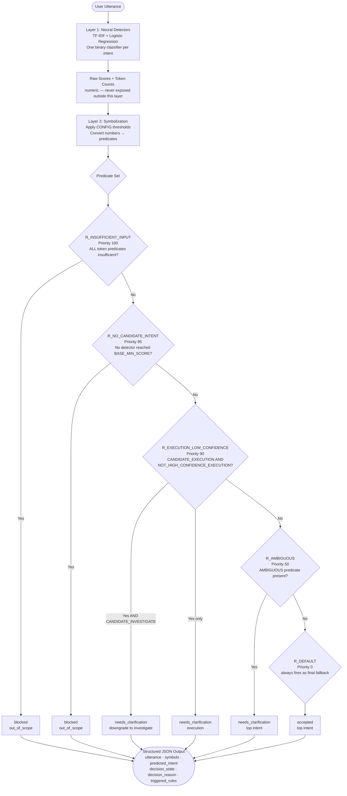

# Level 1: Symbol-Aligned Neuro-Symbolic Intent Classification

## Overview

Level 1 is a **3-layer neuro-symbolic architecture** that cleanly separates numeric signals from symbolic reasoning. The key design principle is strict isolation: numeric scores never leave the neural layer. A dedicated symbolization layer converts all signals into logical predicates, and the rule engine operates exclusively on those predicates — no numbers, no thresholds, no conditionals inside rules.

This separation makes the system's decisions **auditable, explainable, and easy to modify** without touching model code.

---

## Architecture

```
┌─────────────────────────────────────────────────────────────────────┐
│  Layer 1 – Neural Detectors (numeric, internal only)                │
│  Four independent TF-IDF + Logistic Regression binary classifiers   │
│  Outputs: raw float scores per intent (do NOT sum to 1)             │
└──────────────────────────────┬──────────────────────────────────────┘
                               │  raw scores + token counts
                               ▼
┌─────────────────────────────────────────────────────────────────────┐
│  Layer 2 – Symbolization (thresholds live here and ONLY here)       │
│  Converts numbers → logical predicates                              │
│  Example: score(execution) ≥ 0.30  →  CANDIDATE_EXECUTION          │
└──────────────────────────────┬──────────────────────────────────────┘
                               │  predicate set (pure symbols)
                               ▼
┌─────────────────────────────────────────────────────────────────────┐
│  Layer 3 – Symbolic Rule Engine (no numbers, rules are plain JSON)  │
│  Reads rules from models/level1/rules.json                          │
│  Outputs: predicted_intent + decision_state + triggered_rules       │
└─────────────────────────────────────────────────────────────────────┘
```

---

## Files

| File | Description |
|---|---|
| `level1_model.py` | `Level1Classifier` — neural, symbolization, and rule-engine layers; `CONFIG` dict (thresholds only) |
| `level1_symbolic_intent_classification.ipynb` | End-to-end notebook: train → symbolize → evaluate → save |
| `models/level1/config.json` | Serialized `CONFIG` and intent list |
| `models/level1/rules.json` | Symbolic rules as plain JSON (human-readable, zero numeric values) |
| `models/level1/detector_<intent>.pkl` | One binary detector per intent (4 files) |
| `artifacts/level1/level1_predictions.csv` | Full test-set predictions including symbols and triggered rules |
| `artifacts/level1/evaluation_metrics.json` | Accuracy, decision-state distribution, rule trigger counts, config snapshot |

---

## Dataset
- **Source**: `data/intents_base.csv` (at repo root)
- **Records**: 1,661 utterances
- **Intent Classes**: `investigate`, `execution`, `summarization`, `out_of_scope`
- **Class Distribution**: `out_of_scope` 480 · `execution` 413 · `investigate` 412 · `summarization` 356

---

## Configuration

All numeric thresholds live exclusively in `CONFIG` and are consumed only inside `_symbolize()`. The rule engine never reads them.

```python
CONFIG = {
    'BASE_MIN_SCORE':        0.30,   # Minimum detector score to become a candidate
    'HIGH_CONFIDENCE_SCORE': 0.85,   # Score required for autonomous execution approval
    'AMBIGUITY_MARGIN':      0.10,   # Max gap between top-2 scores before flagging ambiguity
    'RAW_MIN_TOKENS':        2,      # Minimum raw token count for valid input
    'UNIQUE_MIN_TOKENS':     2,      # Minimum unique token count
    'MODEL_MIN_TOKENS':      2,      # Minimum active TF-IDF features
    'RANDOM_STATE':          42,
    'TEST_SIZE':             0.2
}
```

---

## Symbolization Layer

Converts all numeric signals into logical predicates. No domain keyword lists are used — the detectors handle domain specificity, keeping this layer neutral and purely statistical.

| Predicate | Condition |
|---|---|
| `CANDIDATE_<INTENT>` | detector score ≥ `BASE_MIN_SCORE` (0.30) |
| `HIGH_CONFIDENCE_<INTENT>` | detector score ≥ `HIGH_CONFIDENCE_SCORE` (0.85) |
| `NOT_HIGH_CONFIDENCE_EXECUTION` | negation of above, added for rule convenience |
| `NO_CANDIDATE_INTENT` | no detector reached `BASE_MIN_SCORE` |
| `AMBIGUOUS` | top-to-second score margin < `AMBIGUITY_MARGIN` (0.10) |
| `RAW_TOKEN_COUNT_SUFFICIENT/INSUFFICIENT` | raw token count vs `RAW_MIN_TOKENS` |
| `UNIQUE_TOKEN_COUNT_SUFFICIENT/INSUFFICIENT` | unique token count vs `UNIQUE_MIN_TOKENS` |
| `MODEL_TOKEN_COUNT_SUFFICIENT/INSUFFICIENT` | active TF-IDF features vs `MODEL_MIN_TOKENS` |
| `VERY_SHORT_UTTERANCE` | raw token count ≤ 1 |

---

## Rule Engine

Rules are loaded from `models/level1/rules.json` at runtime. They are pure data — inspectable, versionable, and modifiable without touching Python code.

| Rule | Priority | Condition | Outcome |
|---|---|---|---|
| `R_INSUFFICIENT_INPUT` | 100 | ALL three token predicates insufficient | `blocked` → `out_of_scope` |
| `R_NO_CANDIDATE_INTENT` | 95 | `NO_CANDIDATE_INTENT` | `blocked` → `out_of_scope` |
| `R_EXECUTION_LOW_CONFIDENCE` | 90 | `CANDIDATE_EXECUTION` + `NOT_HIGH_CONFIDENCE_EXECUTION` | `needs_clarification` → `execution` (downgrades to `investigate` if `CANDIDATE_INVESTIGATE`) |
| `R_AMBIGUOUS` | 50 | `AMBIGUOUS` | `needs_clarification` → top intent |
| `R_DEFAULT` | 0 | always (last resort) | `accepted` → top intent |

Rules are evaluated in **strict priority order**. A higher-priority rule that fires stops all lower-priority evaluation immediately (early exit).

---

## System Flow Diagram



---

## Why `investigate` Is Treated Differently Than `execution`

This is the core safety reasoning in Level 1. Even when the neural model is not highly confident about an `investigate` prediction, the system accepts it directly via `R_DEFAULT`. The same low confidence on an `execution` prediction triggers `R_EXECUTION_LOW_CONFIDENCE` and blocks autonomous action.

### The Asymmetry Explained

```
execution   →  mutates state  →  irreversible  →  requires HIGH_CONFIDENCE (0.85)
investigate →  read-only      →  reversible    →  CANDIDATE (0.30) is sufficient
```

`R_EXECUTION_LOW_CONFIDENCE` fires when:
- `CANDIDATE_EXECUTION` is present (score ≥ 0.30), **and**
- `NOT_HIGH_CONFIDENCE_EXECUTION` is present (score < 0.85)

This rule **does not exist** for `investigate`, `summarization`, or `out_of_scope` — because those actions do not perform irreversible state changes.

### The Guardrail Model

The neuro-symbolic system acts as a safety "guardrail" layered on top of the neural model. Even when the model correctly identifies an execution intent, the symbolic layer can say:

> "I think I know what you want, but I'm not confident enough to do it without asking first."

This separation means the **neural model handles recognition** while the **rule engine handles risk**. The model is not responsible for knowing that data migrations are dangerous — the rule engine is.

Since `investigate` is generally a read-only or diagnostic action (e.g., "check what went wrong"), the system is configured to trust the neural model's "Candidate" status without needing the extra "High Confidence" badge required for dangerous execution tasks.

---

## Worked Inference Examples

### Example 1 — Execution Blocked: `"execute the tenant data migration script"`

#### Step 1 — Symbols Produced (The "Why")

The symbolization layer translated the raw scores into these logical flags:

| Symbol | Meaning |
|---|---|
| `CANDIDATE_EXECUTION` | The execution detector score is above the base threshold of $0.30$ |
| `NOT_HIGH_CONFIDENCE_EXECUTION` | Crucially, the score was below the high-confidence threshold of $0.85$ — the model isn't "sure" enough to act autonomously |
| `AMBIGUOUS` | The gap (margin) between the top intent (execution) and the runner-up (investigate) was less than $0.10$ — another category was very close in score |
| `*_TOKEN_COUNT_SUFFICIENT` | The sentence was long enough and contained enough recognizable keywords for a valid classification attempt |

#### Step 2 — Rule Logic (The "Decision")

The rule engine scanned the predicate set in priority order and matched `R_EXECUTION_LOW_CONFIDENCE` (priority 90). This rule fired **before** `R_AMBIGUOUS` (priority 50) was ever evaluated, because higher-priority rules exit early.

**Why this rule?** It is designed to catch any execution request that isn't extremely high-confidence. In code, it has priority 90, so it fires before the more general `R_AMBIGUOUS` rule (priority 50).

**The action:** Instead of setting state to `accepted`, the rule set it to `needs_clarification`.

#### Step 3 — Outcome

| Field | Value | Interpretation |
|:---|:---|:---|
| `predicted_intent` | `execution` | ✅ Correct — the model identified what the user wants |
| `decision_state` | `needs_clarification` | 🛑 Blocked from auto-run — symbolic layer "downgraded" the decision for safety |
| `decision_reason` | `R_EXECUTION_LOW_CONFIDENCE` | The neural score was above candidate threshold but below the high-confidence bar |

**What this means in a real UI:**
> "I think you want to execute a data migration. Is that correct? **[Yes]** / **[No]**"

```json
{
  "utterance": "execute the tenant data migration script",
  "symbols": ["CANDIDATE_EXECUTION", "NOT_HIGH_CONFIDENCE_EXECUTION", "AMBIGUOUS",
               "RAW_TOKEN_COUNT_SUFFICIENT", "UNIQUE_TOKEN_COUNT_SUFFICIENT", "MODEL_TOKEN_COUNT_SUFFICIENT"],
  "predicted_intent": "execution",
  "decision_state": "needs_clarification",
  "decision_reason": "R_EXECUTION_LOW_CONFIDENCE",
  "triggered_rules": ["R_EXECUTION_LOW_CONFIDENCE"],
  "detector_scores": {"execution": 0.62, "investigate": 0.55, "summarization": 0.04, "out_of_scope": 0.01}
}
```

---

### Example 2 — Investigate Accepted: `"check what went wrong"`

#### Step 1 — Symbols Produced

| Symbol | Meaning |
|---|---|
| `CANDIDATE_INVESTIGATE` | The neural detector for investigation scored above `BASE_MIN_SCORE` of $0.30$ |
| `MODEL_TOKEN_COUNT_SUFFICIENT` | The system recognized enough specific keywords (like "check" and "wrong") to make a valid classification |
| `NOT_HIGH_CONFIDENCE_EXECUTION` | This symbol is present because the execution score was low — it satisfies a prerequisite for the system to **ignore** the execution-specific safety rules |

#### Step 2 — Rule Path (The "Decision")

| Rule | Priority | Fired? | Reason |
|---|---|---|---|
| `R_INSUFFICIENT_INPUT` | 100 | ❌ | Tokens are sufficient |
| `R_NO_CANDIDATE_INTENT` | 95 | ❌ | Investigate is a candidate |
| `R_EXECUTION_LOW_CONFIDENCE` | 90 | ❌ | No `CANDIDATE_EXECUTION` predicate — rule doesn't apply |
| `R_AMBIGUOUS` | 50 | ❌ | No `AMBIGUOUS` predicate |
| `R_DEFAULT` | 0 | ✅ | Fires as last resort — accepts top intent |

**Direct path:** No high-priority restrictive rules matched. The utterance "fell through" the priority list until it hit `R_DEFAULT`, which simply accepts the top neural prediction.

#### Step 3 — Outcome

| Field | Value |
|:---|:---|
| `predicted_intent` | `investigate` ✅ |
| `decision_state` | `accepted` ✅ |
| `decision_reason` | `R_DEFAULT` |

```json
{
  "utterance": "check what went wrong",
  "symbols": ["CANDIDATE_INVESTIGATE", "NOT_HIGH_CONFIDENCE_EXECUTION", "MODEL_TOKEN_COUNT_SUFFICIENT"],
  "predicted_intent": "investigate",
  "decision_state": "accepted",
  "decision_reason": "R_DEFAULT",
  "triggered_rules": ["R_DEFAULT"]
}
```

---

### Example 3 — Investigate Accepted: `"analyze the latency spike on node-7"`

Follows the same path as Example 2. Keywords like "analyze" and "latency" provide strong investigate signals.

| Symbol | Meaning |
|---|---|
| `CANDIDATE_INVESTIGATE` | "Analyze" is a strong investigate keyword — detector score ≥ 0.30 |
| `NOT_HIGH_CONFIDENCE_EXECUTION` | Execution score is low — execution safety rules are irrelevant |
| `MODEL_TOKEN_COUNT_SUFFICIENT` | Multiple recognizable technical keywords present |

`R_DEFAULT` fires → `accepted`.

```json
{
  "utterance": "analyze the latency spike on node-7",
  "symbols": ["CANDIDATE_INVESTIGATE", "NOT_HIGH_CONFIDENCE_EXECUTION", "MODEL_TOKEN_COUNT_SUFFICIENT"],
  "predicted_intent": "investigate",
  "decision_state": "accepted",
  "decision_reason": "R_DEFAULT",
  "triggered_rules": ["R_DEFAULT"]
}
```

---

### Summary Comparison Table

| Utterance | Key Symbols | Rule Fired | Decision | Why |
|:---|:---|:---|:---|:---|
| "execute the tenant data migration script" | `CANDIDATE_EXECUTION` + `NOT_HIGH_CONFIDENCE_EXECUTION` + `AMBIGUOUS` | `R_EXECUTION_LOW_CONFIDENCE` | `needs_clarification` | Execution is high-risk; confidence below $0.85$ requires human confirmation |
| "check what went wrong" | `CANDIDATE_INVESTIGATE` + `NOT_HIGH_CONFIDENCE_EXECUTION` | `R_DEFAULT` | `accepted` | No conflicting high-priority rules; investigate is a safe read-only default |
| "analyze the latency spike on node-7" | `CANDIDATE_INVESTIGATE` + `NOT_HIGH_CONFIDENCE_EXECUTION` | `R_DEFAULT` | `accepted` | Same as above — investigation is trusted at the base threshold |

---

### Why the Two Thresholds Exist

$$\text{BASE\_MIN\_SCORE} = 0.30 \quad \text{(candidate threshold — enough to consider the intent)}$$

$$\text{HIGH\_CONFIDENCE\_SCORE} = 0.85 \quad \text{(autonomous execution threshold — required to act without confirmation)}$$

The gap between $0.30$ and $0.85$ defines the **"confirmation zone"** — where the model has recognized intent but the system requires human approval before taking irreversible action. This zone only applies to `execution` because it is the only intent class that mutates system state.

---

## Output Structure

```json
{
  "utterance": "restart nginx on host123",
  "symbols": [
    "CANDIDATE_EXECUTION",
    "NOT_HIGH_CONFIDENCE_EXECUTION",
    "RAW_TOKEN_COUNT_SUFFICIENT",
    "UNIQUE_TOKEN_COUNT_SUFFICIENT",
    "MODEL_TOKEN_COUNT_SUFFICIENT"
  ],
  "predicted_intent": "execution",
  "decision_state": "needs_clarification",
  "decision_reason": "R_EXECUTION_LOW_CONFIDENCE",
  "triggered_rules": ["R_EXECUTION_LOW_CONFIDENCE"],
  "detector_scores": {
    "execution": 0.78,
    "investigate": 0.15,
    "summarization": 0.04,
    "out_of_scope": 0.03
  }
}
```

```json
{
  "utterance": "why is server cpu high",
  "symbols": [
    "CANDIDATE_INVESTIGATE",
    "HIGH_CONFIDENCE_INVESTIGATE",
    "RAW_TOKEN_COUNT_SUFFICIENT",
    "UNIQUE_TOKEN_COUNT_SUFFICIENT",
    "MODEL_TOKEN_COUNT_SUFFICIENT"
  ],
  "predicted_intent": "investigate",
  "decision_state": "accepted",
  "decision_reason": "R_DEFAULT",
  "triggered_rules": ["R_DEFAULT"],
  "detector_scores": {
    "investigate": 0.91,
    "execution": 0.08,
    "summarization": 0.01,
    "out_of_scope": 0.00
  }
}
```

```json
{
  "utterance": "hello",
  "symbols": [
    "RAW_TOKEN_COUNT_INSUFFICIENT",
    "UNIQUE_TOKEN_COUNT_INSUFFICIENT",
    "MODEL_TOKEN_COUNT_INSUFFICIENT",
    "VERY_SHORT_UTTERANCE",
    "NO_CANDIDATE_INTENT"
  ],
  "predicted_intent": "out_of_scope",
  "decision_state": "blocked",
  "decision_reason": "R_INSUFFICIENT_INPUT",
  "triggered_rules": ["R_INSUFFICIENT_INPUT"],
  "detector_scores": {
    "investigate": 0.10,
    "execution": 0.05,
    "summarization": 0.02,
    "out_of_scope": 0.20
  }
}
```

---

## Key Design Decisions

1. **Strict numeric/symbolic separation** — thresholds appear only in `CONFIG` and only inside `_symbolize()`. The rule engine never sees a number.
2. **Neutral symbolization layer** — no domain keyword lists. Detectors handle domain specificity; symbolization applies only statistical thresholds.
3. **Hybrid input quality evidence** — `R_INSUFFICIENT_INPUT` requires *all three* token signals to be insufficient, preventing false blocks on short but model-recognizable vocabulary.
4. **Externalized rules** — `rules.json` is plain data; rules can be added, re-prioritized, or tuned without modifying `level1_model.py`.
5. **Asymmetric safety** — only `execution` has a high-confidence gate. All other intents use `R_DEFAULT` because they do not perform irreversible actions.

---

**Level 1 Status**: ✅ Complete  
**Architecture**: 3-Layer Symbol-Aligned Neuro-Symbolic  
**Key Innovations**: Strict Numeric/Symbolic Separation · Externalized Rules · Asymmetric Safety Gates
