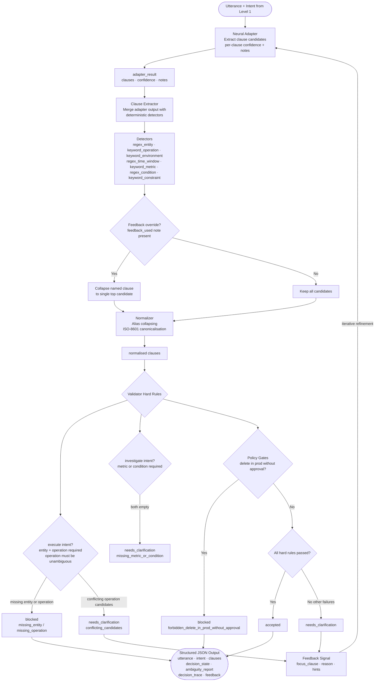

# Level 2: Clause Extraction & Symbolic Validation Pipeline

## Overview

Level 2 takes the **intent** produced by Level 1 and decomposes the utterance into structured **clause candidates** — the parsed arguments needed to act on that intent. It then validates those candidates against intent-specific rules and policy gates, generating actionable feedback for iterative refinement.

What the user wants (intent) comes from Level 1. How to act on it — in the form of structured clauses and a decision — is Level 2's responsibility. The critical path is fully deterministic: the neural adapter is required for cold extraction but every candidate it produces is re-validated by the symbolic layer before any decision is made.

---

## Architecture

```
┌─────────────────────────────────────────────────────────────────────┐
│  Neural Adapter  (adapter.py)                                        │
│  Produces structured clause candidates + per-clause confidence      │
│  Accepts AdapterFeedback for iterative refinement                   │
└──────────────────────────────┬──────────────────────────────────────┘
                               │  adapter_result (clauses, confidence, notes)
                               ▼
┌─────────────────────────────────────────────────────────────────────┐
│  Clause Extractor  (clause_extractor.py)                            │
│  Merges adapter output with deterministic regex/keyword detectors   │
│  Feedback override collapses ambiguous candidates on second pass    │
└──────────────────────────────┬──────────────────────────────────────┘
                               │  clauses: Dict[str, List[str]]
                               ▼
┌─────────────────────────────────────────────────────────────────────┐
│  Normalizer  (normalizer.py)                                        │
│  Alias collapsing, ISO-8601 time canonicalisation                   │
└──────────────────────────────┬──────────────────────────────────────┘
                               │  normalised clauses
                               ▼
┌─────────────────────────────────────────────────────────────────────┐
│  Validator  (validator.py)                                          │
│  Intent-specific hard rules, policy gates, soft rules               │
│  Returns decision_state + feedback for next iteration               │
└─────────────────────────────────────────────────────────────────────┘
                               │
                               ▼
               (decision_state, details, ambiguity, feedback)
```

**Iteration loop**: when `decision_state == "needs_clarification"`, the feedback signal is passed back to the adapter for a refined extraction pass (up to `MAX_ITERATIONS`).

---

## Files

| File | Description |
|---|---|
| `clause_extractor.py` | Adapter merge + deterministic extraction + feedback override |
| `normalizer.py` | Alias collapsing, ISO-8601 canonicalisation |
| `validator.py` | Intent rules, policy gates, decision state, feedback signal |
| `l2_clause_pipeline.ipynb` | End-to-end wiring + iteration loop demo |
| `adapter.py` | Structured neural stub (`AdapterResult`, `AdapterFeedback`) |

---

## Clause Schema

Eight clause fields are tracked throughout the pipeline:

| Field | Description | Example values |
|---|---|---|
| `entity` | Target resource | `nginx-1`, `db-prod-42` |
| `operation` | Action to perform | `restart`, `deploy`, `delete` |
| `metric` | Observable signal | `cpu`, `memory`, `latency` |
| `time_window` | ISO-8601 duration | `PT30M`, `PT1H`, `P1D` |
| `environment` | Deployment tier | `prod`, `staging`, `dev` |
| `condition` | Trigger condition | `when cpu > 90%` |
| `constraint` | Policy constraint | `requires_approval` |
| `output_format` | Desired response format | `json`, `table` |

---

## Clause Extractor

Merges two parallel signal sources into a unified `Dict[str, List[str]]` of candidates per clause.

**Step 1 — Adapter merge**: adapter-provided candidates are inserted first; adapter ordering is trusted as the primary signal.

**Step 2 — Deterministic merge** (deduplication-safe `_merge_unique`):

| Detector | Method | Clause |
|---|---|---|
| `regex_entity` | Pattern `[a-zA-Z0-9_-]+-\d+` | `entity` |
| `keyword_operation` | Keyword list + synonym map | `operation` |
| `keyword_environment` | Keyword list + alias collapsing | `environment` |
| `regex_time_window` | `last N unit` → ISO-8601 | `time_window` |
| `keyword_metric` | Keyword list | `metric` |
| `regex_condition` | `if/when …` patterns | `condition` |
| `keyword_constraint` | `requires approval` patterns | `constraint` |

**Step 3 — Feedback override**: when a `feedback_used:<clause>` note is present in the adapter metadata, the extractor collapses the named clause to its single top candidate, guaranteeing the validator sees no `conflicting_candidates` on the next pass. This is what makes the iteration loop converge.

---

## Normalizer

Applied after extraction, before validation:

- **`normalize_aliases`**: collapses operation synonyms (`reboot` → `restart`, `svc` → `service`)
- **`normalize_time_windows`**: ensures ISO-8601 durations are uppercase (`pt30m` → `PT30M`)
- **`normalize_clauses`**: dispatches per-field normalization and strips whitespace from all other fields

---

## Validator

Returns `(decision_state, details, ambiguity, feedback)`.

#### Decision States

| State | Meaning |
|---|---|
| `accepted` | All hard rules passed, no conflicting candidates |
| `needs_clarification` | Missing or ambiguous clauses — iteration is possible |
| `blocked` | Policy violation — cannot proceed without constraint resolution |

#### Acceptance Logic

```python
if not hard_failed and not ambiguity["conflicting_candidates"]:
    state = "accepted"
elif ambiguity["conflicting_candidates"]:
    state = "needs_clarification"   # adapter can resolve via feedback
    ambiguity["needs_iteration"] = True
else:
    # missing clauses → needs_clarification
    # policy conflicts → blocked
```

#### Hard Rules (by intent)

**`execute`**:

| Rule | Condition | Failure key |
|---|---|---|
| Entity required | `clauses["entity"]` is empty | `missing_entity` |
| Operation required | `clauses["operation"]` is empty | `missing_operation` |
| Operation unambiguous | `len(clauses["operation"]) > 1` | → `conflicting_candidates` |

**`investigate`**:

| Rule | Condition | Failure key |
|---|---|---|
| Metric or condition required | both `metric` and `condition` empty | `missing_metric_or_condition` |

#### Policy Gates

| Gate | Condition | Outcome |
|---|---|---|
| Delete in prod | `delete` in operations AND `prod` in environment AND `requires_approval` absent | `blocked` — `forbidden_delete_in_prod_without_approval` |

#### Soft Rules (non-blocking)

| Rule | Condition | Signal |
|---|---|---|
| Time window present | `clauses["time_window"]` non-empty | `has_time_window` added to `soft_passed` |

#### Feedback Signal

When validation cannot accept, structured feedback is returned to guide the next adapter pass:

```python
{
  "focus_clause": "operation",          # which clause to re-examine
  "reason": "conflicting_candidates",   # why it failed
  "hints": ["restart"]                  # heuristic preferred candidates
}
```

---

## Neural Adapter

Deterministic by default (fully testable), designed to be drop-in replaced with a real LLM or NN.

- Returns `AdapterResult(clauses, confidence, notes)` — one ordered candidate list per clause
- Accepts an `AdapterFeedback` object to refine output on subsequent iterations
- When feedback is used, appends a `feedback_used:<clause>` note to `notes` — the hook the extractor's feedback override reads
- Per-clause `confidence` dict allows the validator to weight signals if needed

---

## System Flow Diagram



---

## Why `execute` Has Stricter Rules Than `investigate`

This is the core safety reasoning in Level 2. Even when the adapter is not fully confident about an `execute` clause set, the system requires both entity and operation to be present and unambiguous before accepting. The same missing or conflicting clauses on an `investigate` utterance trigger clarification, but never a hard block.

### The Asymmetry Explained

```
execute     →  mutates state  →  irreversible  →  entity + operation required + unambiguous
investigate →  read-only      →  reversible    →  metric OR condition sufficient
```

The hard-block / policy-gate path exists only for `execute` because `investigate` actions do not perform irreversible state changes. A `delete` operation in `prod` additionally requires an explicit `requires_approval` constraint — it cannot succeed even with full confidence until that constraint is present.

### The Guardrail Model

The symbolic validator acts as a safety "guardrail" layered on top of the neural adapter. Even when the adapter correctly identifies entities and operations, the symbolic layer can say:

> "I think I know what you want, but the operation is ambiguous — should I restart or start? **[restart]** / **[start]**"

This separation means the **adapter handles recognition** while the **validator handles risk**. The adapter is not responsible for knowing that a delete-in-prod without approval is dangerous — the validator is.

Since `investigate` is generally a read-only or diagnostic action (e.g., "check what went wrong"), the system is configured to accept it when the neural adapter is at candidate confidence, without the extra unambiguity requirement reserved for dangerous execution tasks.

---

## Worked Inference Examples

### Example 1 — Accepted: `"restart nginx-1 in prod"`

#### Step 1 — Clauses Extracted

| Clause | Candidates | Source |
|---|---|---|
| `entity` | `["nginx-1"]` | adapter + `regex_entity` |
| `operation` | `["restart"]` | adapter + `keyword_operation` |
| `environment` | `["prod"]` | adapter + `keyword_environment` |
| all others | `[]` | no signal |

#### Step 2 — Validation Path

| Check | Result |
|---|---|
| entity present? | ✅ `nginx-1` |
| operation present? | ✅ `restart` |
| operation unambiguous? | ✅ single candidate |
| policy gate (delete-in-prod)? | ❌ not triggered — operation is `restart` |

#### Step 3 — Outcome

| Field | Value |
|:---|:---|
| `decision_state` | `accepted` ✅ |
| `ambiguity_report` | all empty |

```json
{
  "utterance": "restart nginx-1 in prod",
  "intent": "execute",
  "clauses": {"entity": ["nginx-1"], "operation": ["restart"], "environment": ["prod"]},
  "decision_state": "accepted",
  "ambiguity_report": {"missing_clauses": [], "conflicting_candidates": {}, "needs_iteration": false},
  "feedback": {"focus_clause": null, "reason": null, "hints": []}
}
```

---

### Example 2 — Needs Clarification: `"start or restart nginx-1"`

#### Step 1 — Clauses Extracted

| Clause | Candidates | Source |
|---|---|---|
| `entity` | `["nginx-1"]` | adapter + `regex_entity` |
| `operation` | `["start", "restart"]` | adapter + `keyword_operation` — two matches |

#### Step 2 — Validation Path

| Check | Result |
|---|---|
| entity present? | ✅ |
| operation present? | ✅ |
| operation unambiguous? | ❌ two candidates — `conflicting_candidates` set |

#### Step 3 — Outcome & Iteration

```
decision_state: needs_clarification
conflicting_candidates: {"operation": ["start", "restart"]}
feedback: {focus_clause: "operation", reason: "conflicting_candidates", hints: ["restart"]}
→ adapter re-runs with feedback → extractor collapses operation to ["restart"] → accepted
```

```json
{
  "utterance": "start or restart nginx-1",
  "intent": "execute",
  "decision_state": "needs_clarification",
  "ambiguity_report": {"conflicting_candidates": {"operation": ["start", "restart"]}, "needs_iteration": true},
  "feedback": {"focus_clause": "operation", "reason": "conflicting_candidates", "hints": ["restart"]}
}
```

---

### Example 3 — Blocked: `"delete nginx-1 in prod"`

#### Step 1 — Clauses Extracted

| Clause | Candidates | Source |
|---|---|---|
| `entity` | `["nginx-1"]` | adapter + `regex_entity` |
| `operation` | `["delete"]` | adapter + `keyword_operation` |
| `environment` | `["prod"]` | adapter + `keyword_environment` |
| `constraint` | `[]` | no signal |

#### Step 2 — Validation Path

| Check | Result |
|---|---|
| entity present? | ✅ |
| operation present? | ✅ |
| operation unambiguous? | ✅ |
| policy gate (delete-in-prod without approval)? | ❌ triggered — `requires_approval` absent |

#### Step 3 — Outcome

| Field | Value |
|:---|:---|
| `decision_state` | `blocked` 🛑 |
| `hard_rules_failed` | `forbidden_delete_in_prod_without_approval` |

**What this means in a real UI:**
> "I cannot delete nginx-1 in prod without an explicit approval constraint. Add `requires_approval` to proceed."

```json
{
  "utterance": "delete nginx-1 in prod",
  "intent": "execute",
  "decision_state": "blocked",
  "ambiguity_report": {"policy_conflicts": ["forbidden_delete_in_prod_without_approval"], "needs_iteration": false},
  "feedback": {"focus_clause": "constraint", "reason": "policy_requires_constraint", "hints": ["requires_approval"]}
}
```

---

### Summary Comparison Table

| Utterance | Key Clauses | Rule / Gate Fired | Decision | Why |
|:---|:---|:---|:---|:---|
| "restart nginx-1 in prod" | entity + operation unambiguous | — | `accepted` | All hard rules passed, no policy conflicts |
| "start or restart nginx-1" | operation has two candidates | conflicting_candidates | `needs_clarification` | Conflicting candidates — adapter re-runs with feedback hint |
| "check nginx-1" (investigate) | metric=[], condition=[] | missing_metric_or_condition | `needs_clarification` | Missing metric or condition — required for investigate |
| "delete nginx-1 in prod" | operation=delete, constraint=[] | delete-in-prod policy gate | `blocked` | Policy gate: delete-in-prod requires approval constraint |
