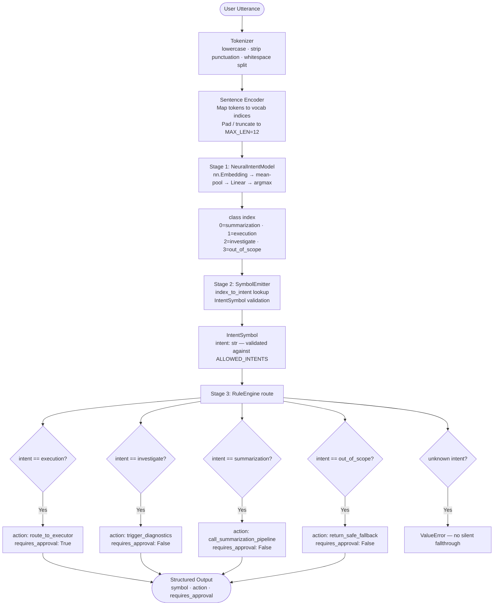

# Level 3: Neural Intent Classifier (Neuro-Symbolic Pipeline)

## Overview

Level 3 implements a **3-stage neuro-symbolic pipeline** that cleanly separates neural perception from symbolic reasoning. The key design principle is strict boundary enforcement: the raw class index produced by the neural model is never used directly to make decisions. A dedicated symbol emitter converts it into a typed `IntentSymbol`, and the rule engine operates exclusively on that symbol — no logits, no probabilities, no conditionals inside rules.

This separation makes every decision **auditable and modifiable** without touching model code, while allowing the neural backbone to be swapped for a more powerful model without changing the symbolic layer at all.

---

## Architecture

```
┌─────────────────────────────────────────────────────────────────────┐
│  Stage 1 – Neural Intent Model  (neural_intent_model.py)            │
│  nn.Embedding → mean-pool → Linear → argmax → class index (int)    │
│  Trained on utterance → intent pairs; outputs a discrete index only │
└──────────────────────────────┬──────────────────────────────────────┘
                               │  class index (int, internal only)
                               ▼
┌─────────────────────────────────────────────────────────────────────┐
│  Stage 2 – Symbol Emitter  (symbol_emitter.py)                      │
│  Maps class index → IntentSymbol (validated dataclass)              │
│  Boundary: no raw scores or logits cross this stage                 │
└──────────────────────────────┬──────────────────────────────────────┘
                               │  IntentSymbol(intent: str)
                               ▼
┌─────────────────────────────────────────────────────────────────────┐
│  Stage 3 – Rule Engine  (rule_engine.py)                            │
│  IntentSymbol → action + requires_approval (pure symbol dispatch)   │
│  No numeric values — operates on intent strings only                │
└─────────────────────────────────────────────────────────────────────┘
                               │
                               ▼
               { "symbol": intent_str, "decision": { "action", "requires_approval" } }
```

**Pipeline wiring**: `Level3Pipeline` (`level3_pipeline.py`) chains all three stages into a single `process(input_ids)` call.

---

## Files

| File | Description |
|---|---|
| `__init__.py` | Package marker |
| `intent_constants.py` | Canonical intent string constants + `ALLOWED_INTENTS` set |
| `symbol_schema.py` | `IntentSymbol` dataclass — validates intent is in `ALLOWED_INTENTS` |
| `symbol_emitter.py` | Maps class index (int) → `IntentSymbol` |
| `neural_intent_model.py` | `nn.Embedding` + mean-pool + `Linear` classifier; `predict()` returns class index |
| `rule_engine.py` | Symbolic dispatch table: `IntentSymbol` → `{action, requires_approval}` |
| `level3_pipeline.py` | Chains model → emitter → rule engine; `load_model_state()` |
| `level3_intent_classifier.ipynb` | End-to-end training, evaluation, and inference notebook |

---

## Dataset

- **Source**: `data/intents_base.csv` (repo root — shared with Level 0 and Level 1)
- **Records**: 1,661 utterances
- **Intent Classes**: `investigate`, `execution`, `summarization`, `out_of_scope`
- **Class Distribution**: `out_of_scope` 480 · `execution` 413 · `investigate` 412 · `summarization` 356

---

## Model Configuration

The neural model is initialised with these hyperparameters in the notebook:

| Parameter | Value | Purpose |
|---|---|---|
| `VOCAB_SIZE` | built from training data | Size of the word index |
| `EMBED_DIM` | 16 | Embedding dimension per token |
| `NUM_CLASSES` | 4 | One output logit per intent |
| `MAX_LEN` | 12 | Tokens per utterance (pad / truncate) |
| `EPOCHS` | 40 | Training passes |
| `LR` | 1e-3 | Adam learning rate |
| `BATCH_SIZE` | 16 | Training batch size |

Index-to-intent mapping (fixed at training time):

| Index | Intent |
|---|---|
| 0 | `summarization` |
| 1 | `execution` |
| 2 | `investigate` |
| 3 | `out_of_scope` |

---

## Neural Intent Model

`NeuralIntentModel` is a minimal embedding classifier:

```python
forward(input_ids):               # (batch, seq_len)
    embedded = Embedding(input_ids)   # (batch, seq_len, embed_dim)
    pooled   = embedded.mean(dim=1)   # (batch, embed_dim)  — simple average pooling
    logits   = Linear(pooled)         # (batch, num_classes)
    return logits

predict(input_ids):
    logits    = forward(input_ids)
    class_idx = argmax(logits, dim=-1)
    return class_idx                  # int — the only value that leaves this stage
```

The model is intentionally simple. The purpose of Level 3 is to demonstrate the **neuro-symbolic wiring**, not to maximise classification accuracy with a complex backbone.

---

## Symbol Emitter

Converts the discrete class index from the model into a validated `IntentSymbol`:

```python
index_to_intent = {
    0: "summarization",
    1: "execution",
    2: "investigate",
    3: "out_of_scope",
}

def emit(class_index: int) -> IntentSymbol:
    intent = index_to_intent[class_index]   # KeyError if unknown index
    return IntentSymbol(intent=intent)       # ValueError if not in ALLOWED_INTENTS
```

`IntentSymbol.__post_init__` validates the intent string against `ALLOWED_INTENTS`. This is the explicit symbolic boundary: raw integers do not enter the rule engine.

---

## Rule Engine

Pure dispatch on `symbol.intent` — no numeric comparisons, no thresholds.

| Intent Symbol | Action | Requires Approval |
|---|---|---|
| `summarization` | `call_summarization_pipeline` | No |
| `execution` | `route_to_executor` | **Yes** |
| `investigate` | `trigger_diagnostics` | No |
| `out_of_scope` | `return_safe_fallback` | No |

`route(symbol)` raises `ValueError` for any unhandled intent, preventing silent fallthrough.

---

## Notebook

### `level3_intent_classifier.ipynb`

End-to-end training and evaluation notebook. Run all cells top-to-bottom to go from raw CSV to a saved model and a working inference pipeline.

| Cell | Purpose |
|------|---------|
| 1 | Imports — loads all level3 modules; purges `sys.modules` cache so edits to `.py` files are always picked up without a kernel restart |
| 2 | Load dataset (`data/intents_base.csv` at repo root) |
| 3 | Label mapping — maps intent strings to integer indices |
| 4 | Tokenizer — lowercase, strip punctuation, whitespace split |
| 5 | Build vocabulary — frequency-ordered word index, index 0 = `<PAD>` |
| 6 | Sentence encoder — pads/truncates to `MAX_LEN=12` |
| 7 | `IntentDataset` + `DataLoader` |
| 8 | Initialise `NeuralIntentModel` (embedding → mean-pool → linear) |
| 9 | Training loop — 40 epochs, Adam, cross-entropy loss |
| 10 | Save model weights to `level3_intent_model.pt` |
| 11 | Load `Level3Pipeline` from saved weights |
| 12 | Inference helper — tokenizes + encodes text, runs full pipeline |
| 13 | Test suite — four canonical examples with pass/fail reporting |

**Quick start:**
```bash
cd level3
jupyter notebook level3_intent_classifier.ipynb
```

---

## System Flow Diagram



---

## Why `execution` Requires Approval and Others Do Not

This is the core safety reasoning in Level 3. The rule engine does not use any probability or confidence value — it acts purely on which `IntentSymbol` it receives. The `requires_approval` flag is hard-coded per intent class, not computed from a score.

### The Asymmetry Explained

```
execution   →  mutates state  →  irreversible  →  requires_approval: True
investigate →  read-only      →  reversible    →  requires_approval: False
summarize   →  read-only      →  reversible    →  requires_approval: False
out_of_scope → no action      →  safe fallback →  requires_approval: False
```

The `requires_approval: True` flag on `execution` is unconditional — it fires regardless of how confident the neural model was. The rule engine has no access to logits or softmax probabilities. This is intentional: **confidence is a neural concern; risk is a symbolic concern**.

### The Guardrail Model

The rule engine acts as a safety "guardrail" layered on top of the neural model. Even when the model has correctly identified an execution intent with high confidence, the symbolic layer always requires approval before action:

> "I think you want to execute something. This requires approval before I proceed."

This separation means the **neural model handles recognition** while the **rule engine handles risk**. The model does not need to know that execution actions are irreversible — the rule engine does.

---

## Worked Inference Examples

### Example 1 — Execution (Requires Approval): `"restart web-01 in production"`

#### Step 1 — Neural Perception

| Stage | Output |
|---|---|
| Tokenizer | `["restart", "web01", "in", "production"]` (after punctuation strip) |
| Encoder | `[idx_restart, idx_web01, idx_in, idx_production, 0, 0, 0, 0, 0, 0, 0, 0]` (padded to 12) |
| Model | logits → argmax → class index `1` |

#### Step 2 — Symbolic Boundary

| Stage | Output |
|---|---|
| `SymbolEmitter.emit(1)` | `IntentSymbol(intent="execution")` |
| `IntentSymbol.__post_init__` | validates `"execution"` ∈ `ALLOWED_INTENTS` ✅ |

#### Step 3 — Rule Dispatch & Outcome

| Check | Result |
|---|---|
| `intent == "execution"`? | ✅ matches |
| Action | `route_to_executor` |
| Requires approval | **Yes** — unconditional |

```json
{
  "symbol": "execution",
  "decision": {
    "action": "route_to_executor",
    "requires_approval": true
  }
}
```

**What this means in a real system:**
> "I recognised an execution intent. Routing to the executor is blocked until an approval signal is received."

---

### Example 2 — Investigate (Accepted): `"check what went wrong with node-7"`

#### Step 1 — Neural Perception

| Stage | Output |
|---|---|
| Tokenizer | `["check", "what", "went", "wrong", "with", "node7"]` |
| Model | logits → argmax → class index `2` |

#### Step 2 — Symbolic Boundary

| Stage | Output |
|---|---|
| `SymbolEmitter.emit(2)` | `IntentSymbol(intent="investigate")` |

#### Step 3 — Rule Dispatch & Outcome

| Check | Result |
|---|---|
| `intent == "investigate"`? | ✅ matches |
| Action | `trigger_diagnostics` |
| Requires approval | No — read-only action |

```json
{
  "symbol": "investigate",
  "decision": {
    "action": "trigger_diagnostics",
    "requires_approval": false
  }
}
```

---

### Example 3 — Out of Scope (Safe Fallback): `"hello"`

#### Step 1 — Neural Perception

| Stage | Output |
|---|---|
| Tokenizer | `["hello"]` |
| Encoder | `[idx_hello, 0, 0, 0, 0, 0, 0, 0, 0, 0, 0, 0]` (11 pad tokens) |
| Model | logits → argmax → class index `3` |

#### Step 2 — Symbolic Boundary

| Stage | Output |
|---|---|
| `SymbolEmitter.emit(3)` | `IntentSymbol(intent="out_of_scope")` |

#### Step 3 — Rule Dispatch & Outcome

| Check | Result |
|---|---|
| `intent == "out_of_scope"`? | ✅ matches |
| Action | `return_safe_fallback` |
| Requires approval | No |

```json
{
  "symbol": "out_of_scope",
  "decision": {
    "action": "return_safe_fallback",
    "requires_approval": false
  }
}
```

---

### Summary Comparison Table

| Utterance | Class Index | Symbol | Action | Requires Approval | Why |
|:---|:---|:---|:---|:---|:---|
| "restart web-01 in production" | 1 | `execution` | `route_to_executor` | **Yes** | Execution mutates state — approval always required |
| "check what went wrong with node-7" | 2 | `investigate` | `trigger_diagnostics` | No | Read-only diagnostic — no approval needed |
| "summarize the last incident report" | 0 | `summarization` | `call_summarization_pipeline` | No | Read-only — no approval needed |
| "hello" | 3 | `out_of_scope` | `return_safe_fallback` | No | No recognised intent — safe no-op |

---

## Output Structure

```json
{
  "symbol": "execution",
  "decision": {
    "action": "route_to_executor",
    "requires_approval": true
  }
}
```

```json
{
  "symbol": "investigate",
  "decision": {
    "action": "trigger_diagnostics",
    "requires_approval": false
  }
}
```

```json
{
  "symbol": "out_of_scope",
  "decision": {
    "action": "return_safe_fallback",
    "requires_approval": false
  }
}
```

---

## Generated Artifact

| File | Description | Committed? |
|------|-------------|------------|
| `level3_intent_model.pt` | Trained PyTorch weights | **No** — in `.gitignore` |

The `.pt` file is produced by Cell 10 and consumed by Cell 11. It is excluded from version control because it is a large binary artifact that can be fully reproduced by running the notebook.

---

## Key Design Decisions

1. **Strict numeric/symbolic separation** — the only value that leaves the neural model is a discrete class index (int). Logits and probabilities are never passed downstream.
2. **Validated symbolic boundary** — `IntentSymbol.__post_init__` rejects any string not in `ALLOWED_INTENTS`, preventing invalid symbols from reaching the rule engine silently.
3. **No confidence-conditional rules** — `requires_approval` on `execution` is unconditional. The rule engine does not weight by model confidence; that is a neural concern, not a symbolic one.
4. **No silent fallthrough** — `RuleEngine.route()` raises `ValueError` on any unhandled intent. Every possible symbol must have an explicit rule.
5. **Swappable backbone** — replacing `NeuralIntentModel` with a transformer or larger model requires no changes to `SymbolEmitter`, `RuleEngine`, or `Level3Pipeline`, as long as `predict()` still returns a class index.
6. **No kernel restart required** — Cell 1 purges `sys.modules` so any edit to a `.py` file is immediately reflected on the next cell run.

---

## Comparison with Other Levels

| Level | Classifier | Symbolic Layer | Decision Output |
|-------|-----------|----------------|-----------------|
| 0 | TF-IDF + LogReg | None | Raw label only |
| 1 | TF-IDF binary detectors (one per intent) | Symbolization predicates + JSON rule engine | `predicted_intent` + `decision_state` + `triggered_rules` |
| 2 | Deterministic heuristics + neural adapter stub | Clause extractor + normalizer + policy validator | `decision_state` + `ambiguity_report` + `feedback` |
| **3** | **PyTorch Embedding + mean-pool + Linear** | **Symbol emitter + rule engine (no numeric values)** | **`symbol` + `action` + `requires_approval`** |

---

**Level 3 Status**: ✅ Complete
**Architecture**: 3-Stage Neuro-Symbolic Pipeline
**Key Innovations**: Strict Numeric/Symbolic Boundary · Validated `IntentSymbol` · Unconditional Approval Gate for Execution
