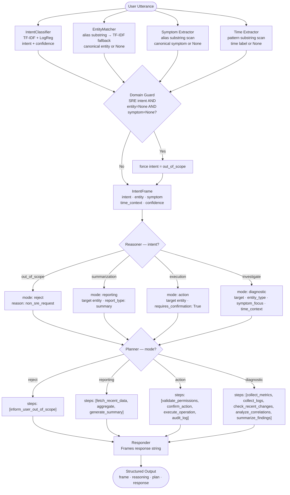

# Level 3.5: Ontology-Grounded Neuro-Symbolic Intent Pipeline

## Overview

Level 3.5 implements a **4-stage neuro-symbolic pipeline** that extends intent recognition into structured reasoning, planning, and response generation. The key design principle is strict stage separation: the ML model produces an intent label and confidence score, the semantic parser converts utterance text into a typed `IntentFrame` (using ontology-grounded symbolic matchers), and every downstream stage — reasoner, planner, responder — operates exclusively on that structured frame.

No raw ML probabilities cross the symbolic boundary. The reasoner never reads a confidence score; it reads symbolic mode labels. This makes every decision **auditable, deterministic, and modifiable** without retraining the model.

---

## Architecture

```
┌─────────────────────────────────────────────────────────────────────┐
│  Stage 1 – Semantic Parser  (semantic_parser.py)                    │
│  IntentClassifier (TF-IDF + LogReg) → (intent, confidence)         │
│  EntityMatcher (alias substring → TF-IDF fallback) → entity        │
│  Symptom extractor (alias substring) → symptom                     │
│  Time extractor (substring patterns) → time_context                │
│  Domain guard: SRE intent + no entity + no symptom → out_of_scope  │
└──────────────────────────────┬──────────────────────────────────────┘
                               │  IntentFrame(intent, entity, symptom,
                               │              time_context, confidence)
                               ▼
┌─────────────────────────────────────────────────────────────────────┐
│  Stage 2 – Reasoner  (reasoner.py)                                  │
│  IntentFrame → deterministic mode selection + context enrichment    │
│  Outputs: mode, target, entity_type, symptom_focus, time_context   │
└──────────────────────────────┬──────────────────────────────────────┘
                               │  reasoning dict
                               ▼
┌─────────────────────────────────────────────────────────────────────┐
│  Stage 3 – Planner  (planner.py)                                    │
│  reasoning["mode"] → ordered list of plan steps                    │
└──────────────────────────────┬──────────────────────────────────────┘
                               │  plan dict: {"steps": [...]}
                               ▼
┌─────────────────────────────────────────────────────────────────────┐
│  Stage 4 – Responder  (responder.py)                                │
│  frame + reasoning + plan → user-facing response string            │
└─────────────────────────────────────────────────────────────────────┘
                               │
                               ▼
        { "frame": {...}, "reasoning": {...}, "plan": {...}, "response": "..." }
```

**Pipeline wiring**: `run_pipeline(utterance)` in `pipeline.py` chains all four stages into a single call.

---

## Files

| File | Description |
|---|---|
| `__init__.py` | Package marker |
| `intent_model.py` | `IntentClassifier` — TF-IDF + LogisticRegression; `train()`, `load()`, `predict()` |
| `entity_matcher.py` | `EntityMatcher` — alias substring match (symbolic), TF-IDF similarity fallback |
| `frame.py` | `IntentFrame` dataclass (intent, entity, symptom, time_context, confidence) |
| `ontology.py` | All canonical vocabularies: `INTENTS`, `ENTITIES`, `ENTITY_ALIASES`, `SYMPTOM_ALIASES`, `TIME_CONTEXT_PATTERNS` |
| `semantic_parser.py` | Orchestrates all extraction; applies domain guard; returns `IntentFrame` |
| `reasoner.py` | Symbolic mode dispatch: `investigate` → diagnostic, `execution` → action, `summarization` → reporting, `out_of_scope` → reject |
| `planner.py` | Maps reasoning mode → ordered list of plan steps |
| `responder.py` | Generates user-facing response string from frame + reasoning + plan |
| `pipeline.py` | `run_pipeline(utterance)` — chains all four stages |
| `level3_5_ns_intent.ipynb` | End-to-end notebook: train model → run pipeline → evaluate → save output |
| `data/level3_5_structured_output.csv` | Full dataset output: intent, entity, symptom, time_context, reasoning mode per row |

---

## Dataset

- **Source**: `data/intents_base.csv` (repo root — shared with Level 0, Level 1, Level 3)
- **Records**: 1,661 utterances
- **Intent Classes**: `investigate`, `execution`, `summarization`, `out_of_scope`
- **Class Distribution**: `out_of_scope` 480 · `execution` 413 · `investigate` 412 · `summarization` 356

---

## Configuration

All numeric parameters are fixed at construction time in the relevant classes:

| Parameter | Value | Where | Purpose |
|---|---|---|---|
| `TfidfVectorizer max_features` | 2000 | `IntentClassifier` | Intent model vocabulary cap |
| `TfidfVectorizer ngram_range` | (1, 2) | `IntentClassifier` | Unigrams and bigrams for intent |
| `LogisticRegression max_iter` | 400 | `IntentClassifier` | Training iterations |
| `LogisticRegression random_state` | 42 | `IntentClassifier` | Reproducibility |
| `TfidfVectorizer ngram_range` | (1, 3) | `EntityMatcher` | Trigrams for alias similarity |
| `EntityMatcher threshold` | 0.28 | `EntityMatcher` | Minimum cosine similarity for TF-IDF fallback |

---

## Ontology

All vocabularies are centralized in `ontology.py`. No domain knowledge is hardcoded inside the pipeline stages.

### INTENTS
```python
INTENTS = ["summarization", "investigate", "execution", "out_of_scope"]
```

### ENTITIES (canonical keys, ~50 total across domains)

| Domain | Canonical entities (selection) |
|---|---|
| Kubernetes / Platform | `horizontal_pod_autoscaler`, `kubernetes_node`, `pod`, `namespace`, `etcd`, `flux` |
| Networking | `dns`, `load_balancer`, `api_gateway`, `service_mesh`, `circuit_breaker`, `tls` |
| Application / Services | `api`, `payment_service`, `service` |
| Messaging / Streaming | `message_queue`, `kafka`, `consumer_group`, `kafka_topic` |
| Data / Storage | `database`, `cache`, `connection_pool`, `disk_io`, `backup`, `storage` |
| Ops / Pipelines | `cron_job`, `ci_cd_pipeline`, `deployment`, `container_image` |
| Observability | `logs`, `metrics`, `alerting`, `incident`, `error_budget`, `health_check` |

Each entity has an `ENTITY_ALIASES` list — observed surface forms from the dataset. The matcher searches these aliases.

### SYMPTOM_ALIASES (17 canonical symptoms)

| Canonical | Example aliases |
|---|---|
| `failure` | "failure", "fail", "failing" |
| `latency_high` | "latency", "response times", "increased response times" |
| `crash` | "crash", "crashing" |
| `restart_loop` | "restart loop", "pod restart loop" |
| `tls_handshake_failure` | "tls handshake", "handshake failures" |
| *(+ 12 more)* | `error`, `slow`, `timeout`, `spike`, `degraded`, `drop`, `leak`, `overflow`, `saturation`, `bottleneck`, `not_ready`, `not_completing`, `empty_output` |

### TIME_CONTEXT_PATTERNS (14 labels)

`last_night`, `today`, `yesterday`, `this_week`, `last_week`, `past_month`, `this_quarter`, `recent`, `sla_window`, `last_24_hours`, `in_the_last`, `over_the_last`, `since`, `past`

---

## Module Details

### Semantic Parser (`semantic_parser.py`)

Orchestrates four independent extractions, then applies a domain guard.

**A — Intent prediction**
```python
intent, conf = _intent_model.predict(utterance)   # TF-IDF + LogReg
if intent not in INTENTS:
    intent = "out_of_scope"
```

**B — Structured extraction (symbolic)**
```python
entity       = _entity_matcher.match(utterance)   # EntityMatcher (see below)
symptom      = _extract_symptom(utterance)         # substring scan of SYMPTOM_ALIASES
time_context = _extract_time_context(utterance)    # substring scan of TIME_CONTEXT_PATTERNS
```

**C — Domain guard**
```python
# If model says SRE intent but the utterance has no recognisable entity or symptom,
# force out_of_scope — prevents false positives on vague or out-of-domain text
if intent != "out_of_scope":
    if entity is None and symptom is None:
        intent = "out_of_scope"
```

---

### Entity Matcher (`entity_matcher.py`)

Two-step matching — symbolic priority, TF-IDF fallback.

**Step 1 — Alias substring match (symbolic)**
Iterates all `(alias_text, canonical)` pairs from `ENTITY_ALIASES`. If any alias string is found as a substring of the lowercased utterance, returns the canonical entity immediately. No model inference.

**Step 2 — TF-IDF similarity fallback**
If no alias matched, vectorizes the utterance with a `TfidfVectorizer(ngram_range=(1,3))` fit over all alias phrases and computes cosine similarity against all alias vectors. Returns the top canonical entity only if `best_score ≥ 0.28`. Returns `None` if below threshold.

---

### Reasoner (`reasoner.py`)

Pure symbolic dispatch on `frame.intent` — no numeric comparisons, no ML scores.

| Intent | Mode | Additional fields |
|---|---|---|
| `out_of_scope` | `reject` | `reason: "non_sre_request"` |
| `summarization` | `reporting` | `target` (entity or `"general"`), `report_type: "summary"` |
| `execution` | `action` | `target` (entity or `"unspecified"`), `requires_confirmation: True` |
| `investigate` | `diagnostic` | `target`, `entity_type` (from `ENTITIES[entity]["type"]`), `symptom_focus`, `time_context` |

`requires_confirmation: True` on `execution` is unconditional — the reasoner does not read the confidence score from the frame. Risk is a symbolic concern; confidence is a neural concern.

---

### Planner (`planner.py`)

Maps reasoning mode → ordered list of plan steps.

| Mode | Steps |
|---|---|
| `reject` | `["inform_user_out_of_scope"]` |
| `reporting` | `["fetch_recent_data", "aggregate", "generate_summary"]` |
| `action` | `["validate_permissions", "confirm_action", "execute_operation", "audit_log"]` |
| `diagnostic` | `["collect_metrics", "collect_logs", "check_recent_changes", "analyze_correlations", "summarize_findings"]` |
| unknown | `["request_clarification"]` |

---

### Responder (`responder.py`)

```python
if reasoning["mode"] == "reject":
    return "Out of scope: I can help with SRE/operations requests (summarize/investigate/execute)."

return (
    f"Intent: {frame.intent}\n"
    f"Entity: {frame.entity}\n"
    f"Symptom: {frame.symptom}\n"
    f"Time Context: {frame.time_context}\n"
    f"Planned Steps: {plan['steps']}"
)
```

---

## Notebook

### `level3_5_ns_intent.ipynb`

End-to-end training, evaluation, and inference notebook. Run all cells top-to-bottom to go from raw CSV to a working inference pipeline.

| Cell | Purpose |
|---|---|
| 1 | Imports — pandas, os, sys |
| 2 | Repo root detection — adds root to `sys.path` |
| 3 | Force-reload level3_5 modules — purges stale `sys.modules` entries, then re-imports all `level3_5.*` modules |
| 4 | Load dataset from `data/intents_base.csv` |
| Train | Train `IntentClassifier` on dataset; saves to `intent_model.joblib` |
| 5 | Dataset validation — check required columns and print intent distribution |
| 6 | Run single example through `run_pipeline()` — print frame, reasoning, plan, response |
| 7 | Run full dataset through pipeline — produces `level3_5_df` with parsed intent, entity, symptom, time_context, reasoning mode per row |
| 8 | Intent alignment check — compare `parsed_intent` vs `gold_intent`; print match rate |
| 9 | Entity coverage diagnostics — `value_counts` of matched entities |
| 10 | Reasoning mode distribution — `value_counts` of mode per row |
| 11 | Demonstration on four labelled test inputs (in-scope + out-of-scope) |
| 12 | Save `level3_5_df` to `data/level3_5_structured_output.csv` |
| Last | Inference on 13 paraphrased / unseen statements across all intents |

**Quick start:**
```bash
cd level3_5
jupyter notebook level3_5_ns_intent.ipynb
```

---

## Why `execution` Always Requires Confirmation

The reasoner sets `requires_confirmation: True` for every `execution` intent unconditionally — regardless of how high the model's confidence score was. The reasoner never reads `frame.confidence`. This mirrors the same safety principle as Level 1 and Level 3.

### The Asymmetry

```
execution   →  mutates state  →  irreversible  →  requires_confirmation: True
investigate →  read-only      →  reversible    →  no confirmation required
summarization → read-only     →  safe          →  no confirmation required
out_of_scope  → rejected      →  no action     →  inform user
```

The `requires_confirmation` flag is determined by which `IntentSymbol` arrives at the reasoner — not by any probability value. This separation means the **model handles recognition** while the **reasoner handles risk**.

### Domain Guard

The semantic parser's domain guard adds a second layer of safety: if the model predicts an SRE intent but the utterance contains no recognisable entity and no recognisable symptom, the system forces `out_of_scope`. This prevents the model from routing vague or out-of-domain utterances into the reasoning pipeline.

---

## System Flow Diagram



---

## Worked Inference Examples

### Example 1 — Investigate (Diagnostic): `"why is the backup not completing within the window"`

#### Step 1 — Semantic Parser

| Extractor | Match | Source |
|---|---|---|
| IntentClassifier | `investigate` | TF-IDF + LogReg model |
| EntityMatcher | `backup` | alias `"backup"` substring match |
| Symptom extractor | `not_completing` | alias `"not completing"` in SYMPTOM_ALIASES |
| Time extractor | `sla_window` | pattern `"within the window"` |
| Domain guard | **passes** — entity and symptom both present |

#### Step 2 — IntentFrame produced
```json
{
  "intent": "investigate",
  "entity": "backup",
  "symptom": "not_completing",
  "time_context": "sla_window",
  "confidence": {"intent": 0.87}
}
```

#### Step 3 — Reasoner

`intent == "investigate"` → mode `diagnostic`

```json
{
  "mode": "diagnostic",
  "target": "backup",
  "entity_type": "data_protection",
  "symptom_focus": "not_completing",
  "time_context": "sla_window"
}
```

#### Step 4 — Planner

`mode == "diagnostic"` →
```json
{"steps": ["collect_metrics", "collect_logs", "check_recent_changes", "analyze_correlations", "summarize_findings"]}
```

#### Step 5 — Responder
```
Intent: investigate
Entity: backup
Symptom: not_completing
Time Context: sla_window
Planned Steps: ['collect_metrics', 'collect_logs', 'check_recent_changes', 'analyze_correlations', 'summarize_findings']
```

---

### Example 2 — Execution: `"restart the message queue consumers"`

#### Step 1 — Semantic Parser

| Extractor | Match | Source |
|---|---|---|
| IntentClassifier | `execution` | model |
| EntityMatcher | `message_queue` | alias `"message queue"` substring match |
| Symptom extractor | `None` | no symptom alias found |
| Time extractor | `None` | no time pattern found |
| Domain guard | **passes** — entity is present |

#### Step 2 — IntentFrame
```json
{"intent": "execution", "entity": "message_queue", "symptom": null, "time_context": null, "confidence": {"intent": 0.79}}
```

#### Step 3 — Reasoner

`intent == "execution"` → mode `action`, `requires_confirmation: True` (unconditional)

```json
{"mode": "action", "target": "message_queue", "requires_confirmation": true}
```

#### Step 4 — Planner
```json
{"steps": ["validate_permissions", "confirm_action", "execute_operation", "audit_log"]}
```

---

### Example 3 — Summarization: `"summarize the horizontal pod autoscaler activity"`

#### Step 1 — Semantic Parser

| Extractor | Match | Source |
|---|---|---|
| IntentClassifier | `summarization` | model |
| EntityMatcher | `horizontal_pod_autoscaler` | alias `"horizontal pod autoscaler"` substring match |
| Symptom extractor | `None` | — |
| Time extractor | `None` | — |
| Domain guard | **passes** — entity present |

#### Step 3 — Reasoner

`intent == "summarization"` → mode `reporting`, `report_type: "summary"`

```json
{"mode": "reporting", "target": "horizontal_pod_autoscaler", "report_type": "summary"}
```

#### Step 4 — Planner
```json
{"steps": ["fetch_recent_data", "aggregate", "generate_summary"]}
```

---

### Example 4 — Out of Scope (Domain Guard): `"how do I play basketball"`

#### Step 1 — Semantic Parser

| Extractor | Match | Source |
|---|---|---|
| IntentClassifier | any SRE intent | (model may misfire on short generic text) |
| EntityMatcher | `None` | no alias matches |
| Symptom extractor | `None` | no symptom alias |
| Domain guard | **fires** — SRE intent + entity=None + symptom=None → `out_of_scope` |

#### Steps 2–4

```json
{"reasoning": {"mode": "reject", "reason": "non_sre_request"}}
{"plan": {"steps": ["inform_user_out_of_scope"]}}
{"response": "Out of scope: I can help with SRE/operations requests (summarize/investigate/execute)."}
```

---

### Summary Comparison Table

| Utterance | Intent | Entity | Symptom | Mode | Plan steps |
|:---|:---|:---|:---|:---|:---|
| "why is the backup not completing within the window" | `investigate` | `backup` | `not_completing` | `diagnostic` | collect_metrics, collect_logs, check_recent_changes, analyze_correlations, summarize_findings |
| "restart the message queue consumers" | `execution` | `message_queue` | `null` | `action` | validate_permissions, confirm_action, execute_operation, audit_log |
| "summarize the horizontal pod autoscaler activity" | `summarization` | `horizontal_pod_autoscaler` | `null` | `reporting` | fetch_recent_data, aggregate, generate_summary |
| "how do I play basketball" | `out_of_scope` (domain guard) | `null` | `null` | `reject` | inform_user_out_of_scope |

---

## Comparison with Other Levels

| Level | Classifier | Symbolic Layer | Decision Output |
|---|---|---|---|
| 0 | TF-IDF + LogReg | None | Raw label only |
| 1 | TF-IDF binary detectors (one per intent) | Symbolization predicates + JSON rule engine (priority-ordered) | `predicted_intent` + `decision_state` + `triggered_rules` |
| 2 | Neural adapter stub | Clause extractor + normalizer + policy validator | `decision_state` + `ambiguity_report` + `feedback` |
| 3 | PyTorch Embedding + mean-pool + Linear → argmax | Symbol emitter + rule dispatch (no numeric values) | `symbol` + `action` + `requires_approval` |
| **4** | **TF-IDF + LogReg** | **Ontology-based entity/symptom/time extractors + domain guard + reasoner + planner** | **frame + reasoning + plan + response** |

---

**Level 3.5 Status**: ✅ Complete  
**Architecture**: 4-Stage Ontology-Grounded Neuro-Symbolic Pipeline  
**Key Innovations**: Ontology-Driven Extraction · Domain Guard · Mode-Tagged Symbolic Reasoning · Step-by-Step Planning · Auditable Structured Output

## Overview

Level 3.5 implements a **modular neuro-symbolic pipeline** for intent understanding, reasoning, and response generation in SRE/DevOps domains. The system combines ML-based intent prediction, ontology-driven symbolic parsing, deterministic reasoning, and stepwise planning. All vocabularies and mappings are centralized in an ontology, and every stage is auditable and extensible.

---

## Architecture

```
┌─────────────────────────────────────────────────────────────────────┐
│  Stage 1 – Semantic Parser (semantic_parser.py)                     │
│  - IntentClassifier (ML, intent_model.py)                           │
│  - EntityMatcher (symbolic+TFIDF, entity_matcher.py)                │
│  - Symptom/Time extractors (pattern, ontology.py)                   │
│  - Domain guard: out_of_scope fallback                              │
└──────────────────────────────┬──────────────────────────────────────┘
                               │  IntentFrame (intent, entity, symptom, time)
                               ▼
┌─────────────────────────────────────────────────────────────────────┐
│  Stage 2 – Reasoner (reasoner.py)                                   │
│  - Symbolic rules for mode selection, context enrichment            │
└──────────────────────────────┬──────────────────────────────────────┘
                               │  reasoning dict
                               ▼
┌─────────────────────────────────────────────────────────────────────┐
│  Stage 3 – Planner (planner.py)                                     │
│  - Converts reasoning into stepwise plan                            │
└──────────────────────────────┬──────────────────────────────────────┘
                               │  plan dict
                               ▼
┌─────────────────────────────────────────────────────────────────────┐
│  Stage 4 – Responder (responder.py)                                 │
│  - Generates user-facing response                                   │
└─────────────────────────────────────────────────────────────────────┘
                               │
                               ▼
               { frame, reasoning, plan, response }
```

**Pipeline wiring**: `run_pipeline(utterance)` in `pipeline.py` chains all four stages.

---

## Files

| File | Description |
|---|---|
| `__init__.py` | Package marker |
| `intent_model.py` | ML model for intent classification (TF-IDF + LogisticRegression) |
| `entity_matcher.py` | Symbolic alias substring matching + TF-IDF fallback |
| `frame.py` | `IntentFrame` dataclass (intent, entity, symptom, time, confidence) |
| `ontology.py` | Canonical vocabularies, aliases, and mappings |
| `semantic_parser.py` | Orchestrates all extraction logic, including domain gating |
| `reasoner.py` | Symbolic rules for mode selection and context enrichment |
| `planner.py` | Converts reasoning into stepwise plans |
| `responder.py` | Generates user-facing responses |
| `pipeline.py` | Chains all above modules for a single utterance |
| `level3_5_ns_intent.ipynb` | End-to-end notebook: demo, diagnostics, and evaluation |

---

## Dataset

- **Source**: `data/intents_base.csv` (repo root)
- **Records**: 1,661 utterances
- **Intent Classes**: `summarization`, `investigate`, `execution`, `out_of_scope`
- **Entities, Symptoms, Time Contexts**: Canonicalized and aliased in `ontology.py`

---

## Model Configuration

| Parameter | Value | Purpose |
|---|---|---|
| `TFIDF max_features` | 2000 | Vocabulary size for intent model |
| `TFIDF ngram_range` | (1, 2) | Unigrams and bigrams |
| `LogisticRegression max_iter` | 400 | Training epochs |
| `random_state` | 42 | Reproducibility |
| `EntityMatcher threshold` | 0.28 | TF-IDF similarity fallback |

---

## Module Details

- **IntentClassifier** (`intent_model.py`):
  - Trained on utterance → intent pairs.
  - `predict(utterance)` returns `(intent, confidence)`.
- **EntityMatcher** (`entity_matcher.py`):
  - 1st: Exact alias substring match (symbolic, from ontology).
  - 2nd: TF-IDF similarity fallback (if no alias match).
- **Frame** (`frame.py`):
  - `IntentFrame(intent, entity, symptom, time_context, confidence)`
  - `.to_dict()` for serialization.
- **Ontology** (`ontology.py`):
  - Canonical lists for intents, entities, symptoms, time contexts, and all aliases.
- **Semantic Parser** (`semantic_parser.py`):
  - Predicts intent, extracts entity/symptom/time, applies domain guard.
- **Reasoner** (`reasoner.py`):
  - Symbolic rules for mode selection: `diagnostic`, `action`, `reporting`, `reject`.
  - Context enrichment: target, entity type, symptom focus, time context.
- **Planner** (`planner.py`):
  - Maps mode to stepwise plan (e.g., `diagnostic` → collect_metrics, analyze_correlations).
- **Responder** (`responder.py`):
  - Generates user-facing response string from all context.
- **Pipeline** (`pipeline.py`):
  - `run_pipeline(utterance)` returns `{frame, reasoning, plan, response}`.

---

## System Flow Diagram

```mermaid
flowchart TD
    A([User Utterance]) --> B[Semantic Parser\nIntentClassifier · EntityMatcher · Symptom/Time Extractors]
    B --> C[IntentFrame\n(intent, entity, symptom, time, confidence)]
    C --> D[Reasoner\nSymbolic rules for mode/context]
    D --> E[Planner\nStepwise plan]
    E --> F[Responder\nUser-facing response]
    F --> G([Structured Output\nframe · reasoning · plan · response])
```

---

## Worked Inference Example

Utterance:
> "Why are API response times increasing today?"

| Stage | Output |
|---|---|
| IntentClassifier | `investigate` |
| EntityMatcher | `api` |
| Symptom extractor | `latency_high` |
| Time extractor | `today` |
| Reasoner | `mode: diagnostic`, `target: api`, `symptom_focus: latency_high`, `time_context: today` |
| Planner | `collect_metrics`, `collect_logs`, `analyze_correlations`, ... |
| Responder | Structured response string |

Sample output:
```json
{
  "frame": {
    "intent": "investigate",
    "entity": "api",
    "symptom": "latency_high",
    "time_context": "today",
    "confidence": {"investigate": 0.92}
  },
  "reasoning": {
    "mode": "diagnostic",
    "target": "api",
    "entity_type": "application_interface",
    "symptom_focus": "latency_high",
    "time_context": "today"
  },
  "plan": {
    "steps": ["collect_metrics", "collect_logs", "analyze_correlations", "summarize_findings"]
  },
  "response": "Intent: investigate\nEntity: api\nSymptom: latency_high\nTime Context: today\nPlanned Steps: ['collect_metrics', 'collect_logs', 'analyze_correlations', 'summarize_findings']"
}
```

---

## Key Design Decisions

1. **Ontology-driven**: All vocabularies, aliases, and mappings are centralized in `ontology.py`.
2. **Symbolic fallback**: If ML intent is in-scope but no entity/symptom is found, domain guard forces `out_of_scope`.
3. **Separation of concerns**: Each module has a single responsibility; pipeline is fully modular.
4. **Auditable**: Every stage produces structured, inspectable output.
5. **Extensible**: New entities, symptoms, or rules can be added in the ontology or reasoner without retraining the model.
6. **Notebook-orchestrated**: The notebook is the main entrypoint for experimentation and diagnostics.

---

## Comparison with Other Levels

| Level | Classifier | Symbolic Layer | Decision Output |
|-------|-----------|----------------|-----------------|
| 0 | TF-IDF + LogReg | None | Raw label only |
| 1 | TF-IDF binary detectors | Symbolization predicates + JSON rule engine | `predicted_intent` + `decision_state` + `triggered_rules` |
| 2 | Deterministic heuristics + neural adapter stub | Clause extractor + normalizer + policy validator | `decision_state` + `ambiguity_report` + `feedback` |
| 3 | PyTorch Embedding + mean-pool + Linear | Symbol emitter + rule engine (no numeric values) | `symbol` + `action` + `requires_approval` |
| **4** | **TF-IDF + LogReg + Ontology** | **Semantic parser + reasoner + planner + responder** | **frame + reasoning + plan + response** |

---

**Level 3.5 Status**: ✅ Complete
**Architecture**: Ontology-Grounded Neuro-Symbolic Pipeline
**Key Innovations**: Ontology-Driven Extraction · Modular Reasoning · Auditable Stepwise Output
