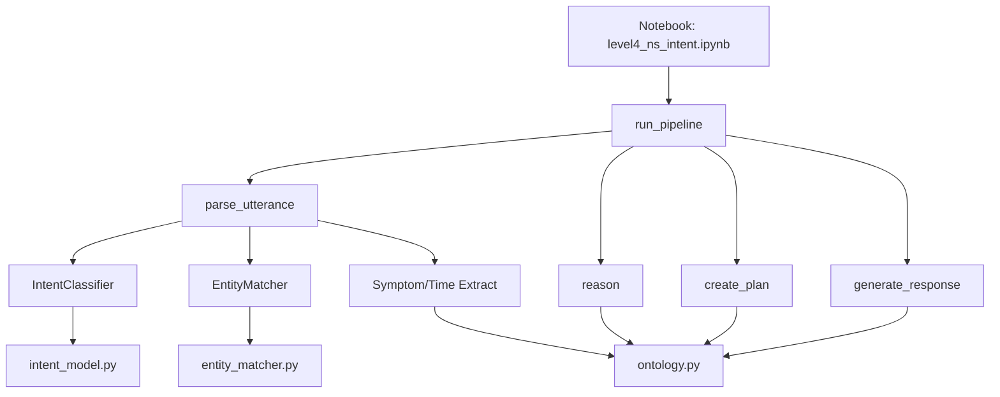

# Level-4 Neuro-Symbolic Intent System

This module implements a neuro-symbolic pipeline for intent understanding, reasoning, and response generation in SRE/DevOps domains. It is designed for clarity, modularity, and extensibility.

**Level-4 definition:** Learned intent prediction + ontology-grounded symbolic parsing + deterministic reasoning/planning. No constraint-aware training, logit masking, or neural-symbolic loss integration.

**What this system is not:**
- No neural-symbolic joint training.
- No symbolic constraint propagation during model inference.
- No reinforcement learning or policy optimization.

## Solution Architecture

- **Notebook (`level4_ns_intent.ipynb`)**: Orchestrates the end-to-end pipeline, running all logic and producing structured outputs and diagnostics.
- **Pipeline Entrypoint (`pipeline.py`)**: Defines `run_pipeline(utterance)` which chains all Level-4 logic.
- **Semantic Parsing (`semantic_parser.py`)**: Extracts intent, entity, symptom, and time context from utterances using:
  - `IntentClassifier` (from `intent_model.py`): ML-based intent prediction.
  - `EntityMatcher` (from `entity_matcher.py`): symbolic alias substring matching with TF-IDF similarity fallback.
  - Symptom/Time extractors: Pattern-based, using vocab from `ontology.py`.
  - Semantic domain gate: If predicted intent is in-scope but neither entity nor symptom is detected, the utterance is forced to out_of_scope.
- **Ontology (`ontology.py`)**: Centralizes canonical intents, entities, symptoms, time contexts, and their aliases.
- **Reasoner (`reasoner.py`)**: Symbolic logic for diagnostic/action/reporting mode selection and context enrichment.
- **Planner (`planner.py`)**: Converts reasoning output into actionable plans.
- **Responder (`responder.py`)**: Generates final user-facing responses from the plan and context.

## File Interactions

- All core logic is in Python modules under `level4/`.
- The notebook imports and reloads these modules, ensuring changes are reflected without kernel restarts.
- Outputs (e.g., structured CSVs) are written to `level4/data/`.
- Trained intent model artifacts are stored under `level4/models/`.

## Flow Diagram

Below is a high-level flow of the Level-4 pipeline:

## Module Overview

- **intent_model.py**: ML model for intent classification.
- **entity_matcher.py**: symbolic alias substring matching with TF-IDF similarity fallback.
- **frame.py**: Defines the IntentFrame schema shared across parser, reasoner, planner, and responder.
- **ontology.py**: Canonical vocabularies and mappings for all domain concepts.
- **semantic_parser.py**: Orchestrates all extraction logic, including domain gating.
- **reasoner.py**: Symbolic rules for mode selection and context enrichment.
- **planner.py**: Converts reasoning into stepwise plans.
- **responder.py**: Generates user-facing responses.
- **pipeline.py**: Chains all above modules for a single utterance.

## Example Flow

Utterance:
> "Why are API response times increasing today?"

1. IntentClassifier → `investigate`
2. EntityMatcher → `api`
3. Symptom extractor → `latency_high`
4. Time extractor → `today`
5. Reasoner → diagnostic mode
6. Planner → collect_metrics → collect_logs → analyze_correlations
7. Responder → structured output

## Design Principles

- **Separation of Concerns**: Each module has a single responsibility.
- **Ontology-Driven**: All vocabularies and mappings are centralized.
- **Notebook-Orchestrated**: The notebook is the main entrypoint for experimentation and evaluation.
- **Hot Reload**: Notebook purges/reloads modules to reflect code changes instantly.

---

For details on extending or modifying the pipeline, see the docstrings in each module.
