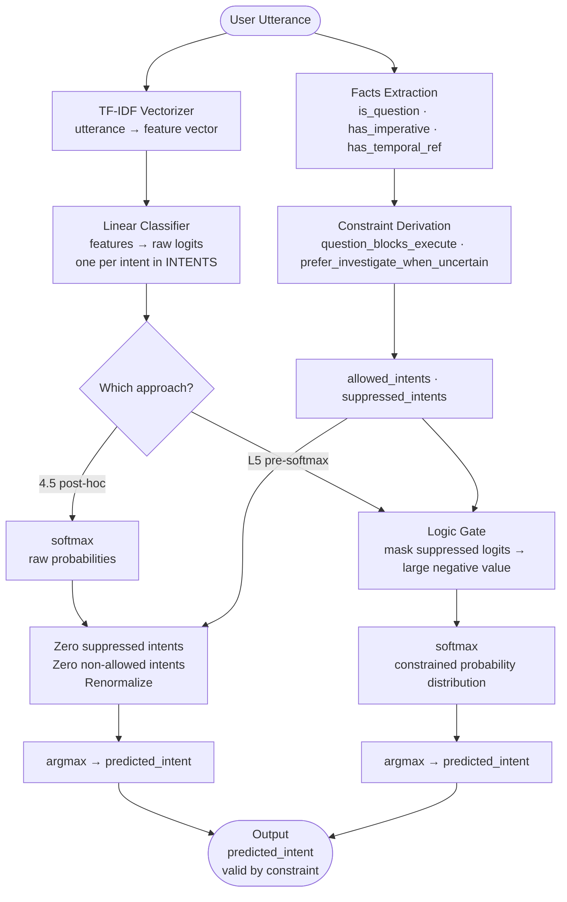

# Level 5: Logic-Gated Neuro-Symbolic Intent Classification

## Overview

Level 5 introduces **constraint-aware training**: the training data itself carries per-utterance logical signals — facts, constraints, allowed intents, and suppressed intents — that are consumed directly by the model. This is a fundamental shift from every previous level, where the dataset contained only `utterance → intent` pairs and all symbolic logic was applied separately from the data.

In Level 5, logic is no longer just an inference-time layer applied on top of the model's output. The goal is to embed it **inside the model's forward pass**, before the softmax activation. The PoC compares two implementations side-by-side:

- **4.5 (post-hoc masking)**: The model predicts raw probabilities first; then a logic gate zeroes suppressed intents and renormalizes. Logic is external and non-differentiable.
- **L5 (pre-softmax gate)**: The logic gate masks suppressed intent logits with large negative values before softmax. Logic participates in the forward pass — gradients flow through constrained outputs, and the model learns representations that are explicitly constraint-aware.

This makes Level 5 decisions **structurally enforced** rather than post-processed, meaning the model cannot produce a suppressed intent even with extreme confidence.

---

## Architecture

```
┌─────────────────────────────────────────────────────────────────────┐
│  Dataset  (data/level5_intents.csv)                                 │
│  Per utterance: gold_intent + facts + constraints +                 │
│                 allowed_intents + suppressed_intents                │
└──────────────────────────────┬──────────────────────────────────────┘
                               │
                               ▼
┌─────────────────────────────────────────────────────────────────────┐
│  TF-IDF Vectorizer  (utterance → feature vector)                    │
└──────────────────────────────┬──────────────────────────────────────┘
                               │  feature vector
                               ▼
┌─────────────────────────────────────────────────────────────────────┐
│  Linear Classifier  (features → logits, one per intent)             │
│  INTENTS = ['investigate', 'execute', 'summarize', 'ops']           │
└──────────────────────────────┬──────────────────────────────────────┘
                               │  raw logits
                               ▼
             ┌─────────────────────────────────────┐
             │  4.5 path (post-hoc)                │
             │  softmax → raw_probs                │
             │  → zero suppressed intents          │
             │  → zero non-allowed intents         │
             │  → renormalize → final_probs        │
             └─────────────────────────────────────┘
             ┌─────────────────────────────────────┐
             │  L5 path (pre-softmax gate)         │
             │  mask suppressed logits → -∞        │
             │  → softmax (constrained dist.)      │
             │  → final_probs                      │
             │  (gradients flow through gate)      │
             └─────────────────────────────────────┘
                               │
                               ▼
                    argmax → predicted_intent
```

---

## Files

| File | Description |
|---|---|
| `level5_data_prep.ipynb` | Compiles the level5 dataset; defines `CONSTRAINT_REGISTRY`; runs logical consistency checks and readiness summary |
| `level5_logic_gating_poc.ipynb` | Trains TF-IDF + Linear classifier; implements and compares 4.5 (post-hoc) vs L5 (pre-softmax) logic gating |
| `l4_a_evaluation.ipynb` | Level-4.5 evaluation notebook — loads the trained Level-4 `IntentClassifier`, runs it over the Level-5 dataset, applies post-hoc constraints (4.5 path), and measures violation rates before vs after; includes a detailed markdown explanation of what Level-4.5 proves and what it cannot fix |
| `data/level5_intents.csv` | Compiled level-5 dataset (utterance + gold_intent + facts + constraints + allowed_intents + suppressed_intents) |

---

## Dataset — What Is Different in Level 5

Every previous level uses a dataset with two columns per row: `utterance` and `intent`. The model only sees the text; all symbolic logic is encoded separately in thresholds, rules, or an ontology.

**Level 5 changes this.** The dataset has six columns per row:

| Column | Type | Content |
|---|---|---|
| `utterance` | string | Raw user text |
| `gold_intent` | string | Ground-truth intent label |
| `facts` | dict | Per-utterance linguistic signals derived from the text |
| `constraints` | dict | Logical rules derived from the facts |
| `allowed_intents` | list | Intents the model is permitted to predict for this utterance |
| `suppressed_intents` | list | Intents that must be structurally blocked for this utterance |

This means **the constraint logic is baked into the training data**. The model is not just told what to predict — it is told, for each training example, which outputs are logically valid and which must be suppressed.

### Facts (per utterance)

Three boolean signals are extracted from the utterance text:

| Key | Type | Meaning |
|---|---|---|
| `is_question` | bool | Utterance is phrased as a question |
| `has_imperative` | bool | Utterance contains an imperative verb (command phrasing) |
| `has_temporal_ref` | bool | Utterance contains a temporal reference ("last night", "yesterday", etc.) |

Example:
```python
# "why is server host123 cpu high"
facts = {'is_question': True, 'has_imperative': False, 'has_temporal_ref': False}

# "check memory usage on db-server-7"
facts = {'is_question': False, 'has_imperative': True, 'has_temporal_ref': False}

# "what caused the outage last night"
facts = {'is_question': True, 'has_imperative': False, 'has_temporal_ref': True}
```

### Constraints (per utterance — derived from facts)

Two logical constraints are derived from the facts:

| Key | Type | Meaning |
|---|---|---|
| `question_blocks_execute` | bool | A question phrasing means execution should be suppressed |
| `prefer_investigate_when_uncertain` | bool | Uncertainty markers bias toward investigation |

Example:
```python
# "why is server host123 cpu high" (is_question=True)
constraints = {'question_blocks_execute': True, 'prefer_investigate_when_uncertain': True}
# → suppressed_intents: ['execute'], allowed_intents: ['investigate', 'ops', 'summarize']

# "check memory usage on db-server-7" (has_imperative=True, is_question=False)
constraints = {'question_blocks_execute': False, 'prefer_investigate_when_uncertain': False}
# → suppressed_intents: [], allowed_intents: ['execute', 'investigate', 'ops', 'summarize']
```

### Suppression Coverage

| suppressed_intents | Count | % of dataset |
|---|---|---|
| `[]` (no suppression) | 434 | 71% |
| `['execute']` | 180 | 29% |

180 of 614 utterances (29%) have `execute` suppressed because they are phrased as questions. These are the rows where `question_blocks_execute: True`.

### Dataset Statistics

- **Source**: `data/intents_level5.csv` (repo root); compiled into `level5/data/level5_intents.csv`
- **Records**: 614 utterances
- **Intent Classes**: `out_of_scope` 169 · `execution` 150 · `investigate` 149 · `summarization` 146
- **Model canonical intents**: `['investigate', 'execute', 'summarize', 'ops']`

---

## Configuration

| Parameter | Value | Where | Purpose |
|---|---|---|---|
| `INTENTS` | `['investigate', 'execute', 'summarize', 'ops']` | `level5_logic_gating_poc.ipynb` | Canonical output classes for the classifier |
| `TfidfVectorizer` | default | notebook | Utterance vectorization |
| `np.random.seed` | 42 | notebook | Reproducibility |
| Logic gate mask value | `-∞` (large negative) | `apply_l45_masking` / L5 forward | Suppressed logits before softmax |
| Fallback (all zeroed) | uniform over allowed | `apply_l45_masking` | Prevents zero-probability edge case |

---

## Constraint Registry

Defined declaratively in `level5_data_prep.ipynb`. Importable and computation-free.

| Constraint key | Type | Description | Rationale |
|---|---|---|---|
| `block_execute` | **hard** | Prevent direct execution when present | Questions/clarifications must not trigger execution |
| `prefer_investigate` | soft | Prefer investigation over execution | Uncertainty markers bias toward investigative actions |
| `allow_execute` | soft | Allow execution when imperative language detected | Imperative phrasing indicates operator intent |
| `require_diagnostic_investigate` | **hard** | Require diagnostic investigation for system-state questions | System-state inquiries require diagnostics before action |
| `require_immediacy_flag` | soft | Mark request as immediate/urgent when temporal + imperative | Communicates urgency for downstream handling |

**Hard constraints** cannot be overridden by the model regardless of confidence. **Soft constraints** bias the prediction but do not structurally block any intent.

---

## What Makes L5 Structurally Different from 4.5

### Timing of Logic Application

```
4.5:  model(x) → raw_probs → apply_logic(raw_probs) → final_probs
  Logic is external and non-differentiable.

L5:   model(x, constraints) → [mask logits] → softmax → final_probs
  Logic is inside the forward pass, before softmax.
```

### Gradient Flow

```
4.5:  Gradients flow through unconstrained predictions. Logic is a post-process.
      The model can (and does) assign high probability to suppressed intents internally.

L5:   Gradients flow through constrained predictions. The model's loss only
      evaluates valid outputs. Invalid intent paths are not reinforced during learning.
```

### Structural Guarantee

```
4.5:  The raw model can produce any intent; corrections are applied after.
      If the logic layer is bypassed, violations occur.

L5:   The model cannot produce a suppressed intent by construction.
      Suppressed logits are set to -∞ before softmax → near-zero probability.
      Violation rate: exactly 0 by design.
```

---

## System Flow Diagram



---

## Why `execute` Is the Only Suppressed Intent

The suppression logic is derived directly from the `facts` column. `execute` is suppressed whenever `question_blocks_execute: True`, which fires when `is_question: True`. This mirrors the same safety asymmetry found in Levels 1–3:

```
execute     →  mutates state  →  irreversible  →  suppressed for any question phrasing
investigate →  read-only      →  reversible    →  always in allowed_intents
summarize   →  read-only      →  safe          →  always in allowed_intents
ops         →  operational    →  context-dep.  →  always in allowed_intents
```

In 29% of utterances in the dataset (180 of 614), `execute` is structurally suppressed because the utterance is phrased as a question. The model is never trained to predict `execute` on those examples — not just penalized, but **structurally prevented** in L5, and corrected after the fact in 4.5.

---

## Notebook Details

### `level5_data_prep.ipynb`

Prepares and validates the Level 5 dataset. Run all cells to compile and check the dataset before running the main PoC notebook.

| Cell | Purpose |
|---|---|
| 1 | Imports — pandas, numpy |
| 2 | Locate repo root; load `level5_intents.csv`; compile and save to `level5/data/` |
| 3 | Define `CONSTRAINT_REGISTRY` — all five constraint keys with type, description, and rationale |
| 4 | Dataset sanity checks — load compiled CSV, parse list-like columns (`allowed_intents`, `suppressed_intents`), validate types |
| 5 | Diagnostics — check for missing values, malformed rows, and constraint/intent consistency |
| 6 | Readiness summary — compute `% with hard constraints`, `% with suppressed_intents`, `logical_violations_count`; print `VERDICT` |

### `level5_logic_gating_poc.ipynb`

Main PoC notebook. Trains the classifier and compares 4.5 vs L5 logic gating.

| Cell | Purpose |
|---|---|
| 1 | Imports — numpy, pandas, sklearn, INTENTS definition |
| 2 | Load dataset from `level5/data/`; parse `allowed_intents` and `suppressed_intents` |
| 3 | TF-IDF vectorize utterances; train/test split |
| 4 | Train base LogReg classifier (no logic gating); evaluate baseline accuracy |
| 5 | **4.5 post-hoc masking** — `apply_l45_masking(probs, allowed, suppressed)`: zero suppressed intents, zero non-allowed, renormalize; compute 4.5 accuracy |
| 6 | **L5 pre-softmax gate** — mask suppressed logits with large negative before softmax; compute L5 accuracy and violation rate |
| 7 | Side-by-side comparison — baseline vs 4.5 vs L5 accuracy and violation counts |
| 8 | Save results to `level5/data/` |

### `l4_a_evaluation.ipynb`

Level-4.5 evaluation notebook. Runs the trained Level-4 `IntentClassifier` over the Level-5 dataset and applies post-hoc constraint masking (the 4.5 path). This notebook establishes the baseline for understanding what inference-time constraint enforcement can and cannot achieve — motivating the need for embedded logic in Level-5.

| Cell | Purpose |
|---|---|
| 1 | Load Level-4 `IntentClassifier` (from `level4/intent_model.joblib`); load Level-5 dataset; normalize shorthand intent names (`execute` → `execution`, `summarize` → `summarization`, `ops` → `out_of_scope`) to match model class names |
| 2 | Baseline Level-4 inference (unconstrained) — run `predict_proba` over all 614 utterances; store raw probability distributions |
| 3 | Apply Level-4.5 post-hoc constraints — zero suppressed intents, zero non-allowed intents, renormalize; store constrained predictions |
| 4 | Comparative metrics — violation rate before vs after, intent flip rate, mean score delta, intent distribution before vs after |
| 5 | Concrete example review — list utterances where the Level-4 raw prediction was invalid and Level-4.5 corrected it |
| 6 | Level-4.5 verdict — print `LEVEL-4.5 SHOWS CLEAR VALUE` or `LIMITED VALUE` based on violation reduction rate |
| Markdown | Detailed explanation covering: what errors Level-4 makes; hard vs soft constraint violations; how Level-4.5 fixes them without retraining; what Level-4.5 cannot fix; and why these limitations motivate Level-5 |

**Quick start:**
```bash
cd level5
jupyter notebook level5_data_prep.ipynb         # prepare and validate dataset
jupyter notebook l4_a_evaluation.ipynb           # Level-4.5 post-hoc evaluation
jupyter notebook level5_logic_gating_poc.ipynb   # Level-5 pre-softmax gating PoC
```

---

## Worked Inference Examples

### Example 1 — Execute Suppressed (Question): `"why is server host123 cpu high"`

#### Step 1 — Facts Extracted

| Signal | Value | Source |
|---|---|---|
| `is_question` | `True` | question word "why" detected |
| `has_imperative` | `False` | no command verb |
| `has_temporal_ref` | `False` | no time reference |

#### Step 2 — Constraints Derived

| Constraint | Value |
|---|---|
| `question_blocks_execute` | `True` |
| `prefer_investigate_when_uncertain` | `True` |

```
allowed_intents:    ['investigate', 'ops', 'summarize']
suppressed_intents: ['execute']
```

#### Step 3 — 4.5 Path

```
TF-IDF → LogReg → raw_probs: [investigate: 0.55, execute: 0.30, summarize: 0.10, ops: 0.05]
apply_l45_masking → zero execute → [investigate: 0.55, execute: 0.00, summarize: 0.10, ops: 0.05]
renormalize        → [investigate: 0.786, execute: 0.000, summarize: 0.143, ops: 0.071]
argmax             → investigate ✅
```

#### Step 4 — L5 Path

```
TF-IDF → Linear → logits: [investigate: 2.1, execute: 1.2, summarize: 0.4, ops: 0.2]
logic gate → logits: [investigate: 2.1, execute: -∞, summarize: 0.4, ops: 0.2]
softmax    → [investigate: 0.85, execute: ~0.00, summarize: 0.10, ops: 0.05]
argmax     → investigate ✅  (execute cannot win by construction)
```

---

### Example 2 — Execute Allowed (Imperative): `"check memory usage on db-server-7"`

#### Step 1 — Facts

| Signal | Value |
|---|---|
| `is_question` | `False` |
| `has_imperative` | `True` |
| `has_temporal_ref` | `False` |

#### Step 2 — Constraints

```
question_blocks_execute:       False
prefer_investigate_when_uncertain: False

allowed_intents:    ['execute', 'investigate', 'ops', 'summarize']  (all)
suppressed_intents: []  (none)
```

#### Step 3 — Both Paths

No suppression applies. Both 4.5 and L5 pass the model's raw prediction through unchanged. Model predicts `investigate` (imperative "check" maps to investigation).

```json
{"predicted_intent": "investigate", "suppressed_intents": [], "constraint_applied": false}
```

---

### Example 3 — Out of Scope / Unknown Intent

Any utterance where the model's top intent after gating maps to a class not in `allowed_intents` falls back to uniform over allowed in the 4.5 path (renormalize over all-zero vector). In L5, large negative masking ensures suppressed classes cannot win softmax.

---

### Summary Comparison Table

| Utterance | is_question | suppressed | 4.5 result | L5 result | Structural guarantee? |
|:---|:---:|:---|:---|:---|:---:|
| "why is server host123 cpu high" | ✅ | `['execute']` | `investigate` (post-hoc fix) | `investigate` (pre-softmax) | ✅ L5 only |
| "check memory usage on db-server-7" | ❌ | `[]` | `investigate` (raw) | `investigate` (raw) | N/A |
| "what caused the outage last night" | ✅ | `['execute']` | `investigate` (post-hoc fix) | `investigate` (pre-softmax) | ✅ L5 only |

---

## Comparison with Other Levels

| Level | Dataset extra signals | Symbolic layer | Logic timing | Structural guarantee |
|---|---|---|---|---|
| 0 | None — utterance + intent only | None | N/A | None |
| 1 | None | Symbolization predicates + JSON rule engine | Inference-time (post-model) | Blocked states only |
| 2 | None | Clause extractor + validator + feedback | Inference-time (post-model) | Hard rules block |
| 3 | None | Symbol emitter + rule dispatch | Inference-time (post-model) | `requires_approval` flag |
| 4 | None | Ontology + domain guard + reasoner | Inference-time (post-model) | Domain guard blocks |
| **5** | **facts · constraints · allowed_intents · suppressed_intents per row** | **Logic gate (pre-softmax in L5; post-hoc in 4.5)** | **Inside forward pass (L5)** | **Zero violations by construction (L5)** |

The key progression: in Levels 1–4, the training data is constraint-free and all symbolic logic is applied after training. In Level 5, the constraints travel with the data — the model is trained with explicit knowledge of which outputs are valid for each utterance.

---

**Level 5 Status**: ✅ PoC Complete  
**Architecture**: Logic-Gated Neuro-Symbolic Classifier  
**Key Innovations**: Constraint-Enriched Training Data · Pre-Softmax Logic Gate · Zero Violation Guarantee (L5) · Dataset-Level Constraint Encoding
